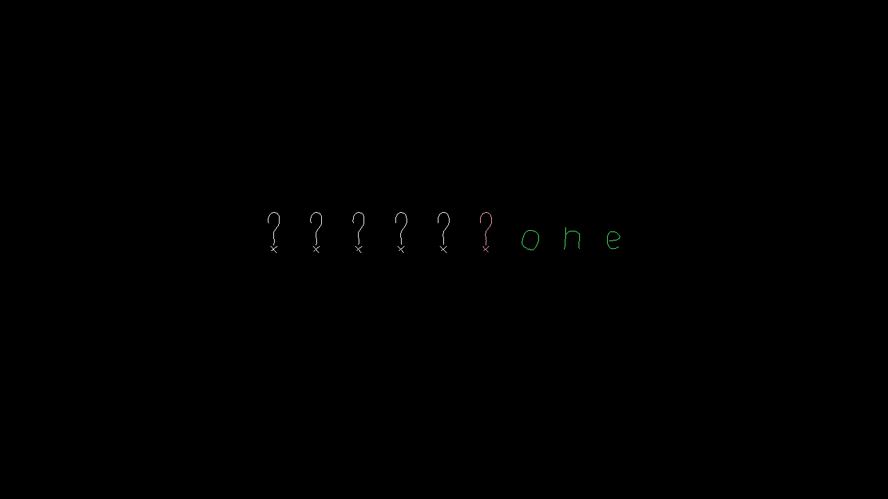

# Listen Close

Author: pbhuang

Listen close and try to memorize what was just said, then repeat it in reverse order. It's that simple and easy (or is it?).

Design: Thinking of audio, this was the best idea I could come up with. In terms of working with models, this idea was actually good since it meant I didn't have to do anything with Blender models and only had to use text for all my visual needs. The audio I all recorded myself and edited myself (all in the dist folder). 

Players can edit what character sequences they want to play with in the [Game.hpp](Game.hpp) file in the WORD_LIST array of strings.

Screenshot:

How To Play:

At the beginning, click 'h' or 'n' to select hard or normal difficulty. Hard difficulty plays sped up sounds and has almost no delay between consecutive letters. Normal plays sounds at normal speed and has more time in between.

After selecting a difficutly, an audio sequence of alphanumeric characters will be played. After it has finished playing, you must type in the sequence backwards.

That's the whole game! Try and get the lowest score. The score is calculated by how long it took for you to complete all the sequences. Each mistake you make will add 2 to your score.

This game was built with [NEST](NEST.md).
